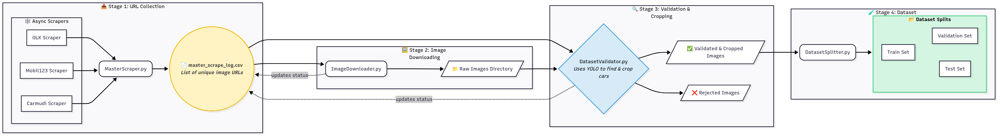
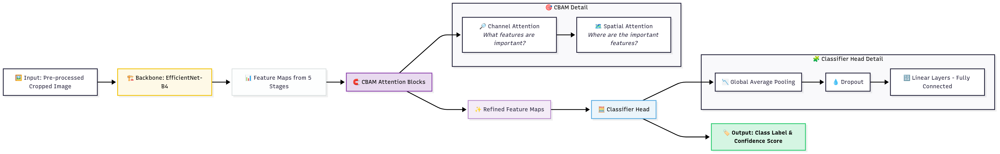

# Indonesian Car Retrieval System


This project presents a complete system for detecting and classifying Indonesian vehicles from video feeds. The system is capable of identifying multiple cars in a video and determining the type of each detected vehicle (e.g., MPV, Sedan, etc.).

The workflow is organized into four main stages, each provided as a Jupyter Notebook:

1. **Data Collection**: Automated scraping of Indonesian car images from various online sources.
2. **Object Detection**: Fine-tuning a YOLO model to detect cars in images.
3. **Image Classification**: Training a custom model to classify detected cars by type.
4. **Inference**: Running the integrated detection and classification pipeline on a test video.

## Project Overview

The goal is to build a two-stage system: first, detect all car instances in a video, then classify each detected car by type. The detection and classification models are developed separately, with the classifier implemented in PyTorch or TensorFlow.

## Pipeline and Methodology

The project follows a step-by-step pipeline, from data gathering to final inference.

### 1. Indonesian Car Image Dataset: Automated Scraping, Validation, and Preparation



*This notebook demonstrates a fully automated workflow for building a high-quality Indonesian car image dataset, ready for machine learning tasks such as classification and detection.*

The process includes scraping images from multiple sources, validating and cropping images, splitting the dataset, and generating reports. Each step ensures the dataset is clean, organized, and suitable for machine learning.

- **Notebook**: [`1_run_scraper_into_dataset.ipynb`](1_run_scraper_into_dataset.ipynb)
- **Sources Used**: OLX, Carmudi, Mobil123
- **Overview**:
  - **Scraping**: Collect car images from multiple online sources, ensuring non-duplicate URLs.
  - **Validation & Cropping**: Check image quality and consistency, and crop to standardize.
  - **Dataset Splitting**: Organize validated images into training, validation, and test sets.
  - **Reporting**: Generate visual and tabular reports on scraping performance, validation status, and class distribution.

### 2. Fine-tuning YOLOv12n for Vehicle Detection

*This notebook covers the process of fine-tuning the YOLOv12n object detection model for custom vehicle detection tasks using a COCO-format dataset.*

It provides a workflow for preparing data, training, and evaluating a YOLOv12n model on Indonesian vehicle images, including environment setup, dataset preparation, model fine-tuning, and performance evaluation with visualizations.

- **Notebook**: [`2_finetune_the_detection_model.ipynb`](2_finetune_the_detection_model.ipynb)
- **Model Used**: **YOLOv12n**, a lightweight and efficient object detection model, suitable for real-time vehicle detection tasks.
- **Overview**:
  - **Dataset**: COCO vehicle dataset, converted to YOLO format for training.
  - **Training Strategy**: Transfer learning using a pretrained YOLOv12n model with a custom training configuration.
  - **Evaluation**: Model performance assessment and confusion matrix visualization.

### 3. Car Classification Model Training

This notebook implements custom models based on the approach described in the paper: [EfficientNet with Hybrid Attention Mechanisms for Enhanced Breast Histopathology Classification: A Comprehensive Approach](https://arxiv.org/pdf/2410.22392v2).

It demonstrates the full pipeline for training and evaluating deep learning models for Indonesian car type classification using a custom dataset. The workflow includes dataset preparation, model training with class imbalance handling, evaluation, and visualization of results.

- **Notebook**: [`3_train_the_classification_model.ipynb`](3_train_the_classification_model.ipynb)
- **Dataset Overview**:
  - **Source**: The dataset used for classification testing is obtained directly by the custom web scraper (see notebook `1_run_scraper_into_dataset.ipynb`).
  - **Kaggle Link**: [Indonesian Cars Classification Dataset](https://www.kaggle.com/datasets/muhammadluthfiarifin/indonesian-cars-classification-dataset)
  - **Final Dataset**: The cleaned and organized dataset is available at the Kaggle link above.
  - **Structure**: The dataset is split into train, validation, and test sets, each containing images for 8 car classes.
- **Model Used**: **EfficientNetB4-CBAM**, which uses EfficientNet-B4 as the backbone and integrates Convolutional Block Attention Module (CBAM) blocks to enhance feature representation.
- **Overview**:
  - **Classes**: 8 Indonesian car types (hatchback, mpv, offroad, pickup, sedan, suv, truck, van).
  - **Training Strategy**: Transfer learning, data augmentation, and weighted loss for class imbalance.
  - **Evaluation**: Per-class metrics, confusion matrix, and visualizations.

#### Classifier Model Architecture



The classifier model is a hybrid architecture that combines EfficientNet-B4 as the backbone with Convolutional Block Attention Module (CBAM) blocks to enhance feature representation. The CBAM modules sequentially apply channel and spatial attention to the feature maps extracted from each stage of EfficientNet-B4, allowing the model to focus on the most informative features and regions. After attention refinement, the final feature map is passed through a classifier head consisting of global average pooling, dropout, and fully connected layers to produce the class label and confidence score.

### 4. Final Inference Pipeline

The last step integrates the detection and classification models into a single pipeline that processes an input video and produces an annotated output video.

- **Notebook**: [`4_final_traffic_cam_test.ipynb`](4_final_traffic_cam_test.ipynb)
- **Description**: This notebook loads the input video (`traffic_test.mp4`). For each frame, it:
  1. Uses the fine-tuned YOLO model to detect cars.
  2. Crops the image of each detected car from the frame.
  3. Passes the cropped image to the trained `EfficientNetB4-CBAM` model for classification.
  4. Draws the bounding box and the predicted class label onto the output frame.
  5. Saves the final annotated video.

## Project Structure

```
.
├── 1_run_scraper_into_dataset.ipynb
├── 2_finetune_the_detection_model.ipynb
├── 3_train_the_classification_model.ipynb
├── 4_final_traffic_cam_test.ipynb
├── data_processing
│   ├── coco_dataset
│   └── scraping
├── models
│   ├── classification
│   └── detection
├── traffic_test.mp4
└── requirements.txt
```

## Setup and Installation

1. **Clone the repository:**

    ```bash
    git clone https://github.com/luthfiarifin/hybrid-envit-car-retrieval.git
    cd hybrid-envit-car-retrieval
    ```

2. **Create a virtual environment (recommended):**

    ```bash
    python -m venv .venv
    source .venv/bin/activate  # On Windows, use `.venv\Scripts\activate`
    ```

3. **Install the required dependencies:**

    ```bash
    pip install -r requirements.txt
    ```

## How to Run the Pipeline

To execute the full pipeline from data collection to final inference, run the Jupyter notebooks in sequential order.

1. **Run [`1_run_scraper_into_dataset.ipynb`](1_run_scraper_into_dataset.ipynb)**: This will scrape the web to build the car dataset for the classification task.
2. **Run [`2_finetune_the_detection_model.ipynb`](2_finetune_the_detection_model.ipynb)**: This will fine-tune the YOLOv12n object detection model.
3. **Run [`3_train_the_classification_model.ipynb`](3_train_the_classification_model.ipynb)**: This will train the classification model on the scraped data.
4. **Run [`4_final_traffic_cam_test.ipynb`](4_final_traffic_cam_test.ipynb)**: This will execute the final pipeline on the provided `traffic_test.mp4`, generating a `traffic_test_classified.mp4` with the results.

---

**You can also quickly test the detection and classification pipeline by running the `app_test.py` file:**

```bash
python app_test.py
```

This will open a window displaying the detection and classification results on the sample video.

## Demo

The final output is a video where each detected car is enclosed in a bounding box with a label indicating its classified type.

**[Click here to download and view the sample output video](traffic_test_classified.mp4)**

## Disclaimer

The dataset provided and used in this project is intended solely for experimental and research purposes. Do not use the dataset or any derivative works for commercial purposes. The authors are not responsible for any misuse of the data.
